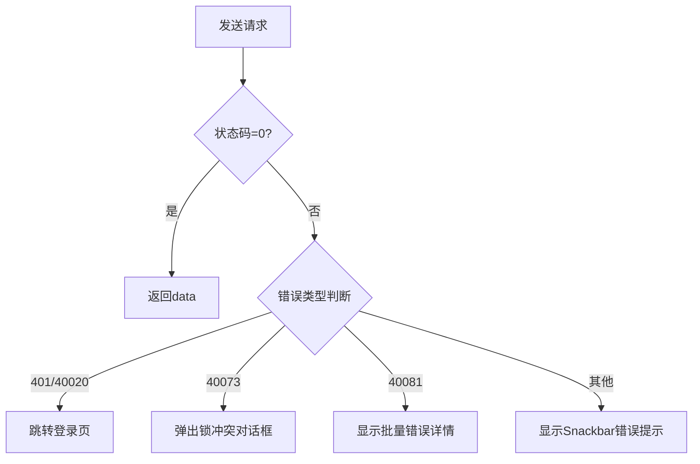

```markdown
# request.ts API 文档

## 接口说明

### `requestOpts`
请求配置选项接口

```typescript
interface requestOpts {
  errorSnackbarMsg: (e: Error) => string; // 错误消息生成函数
  bypassSnackbar?: (e: Error) => boolean; // 是否跳过Snackbar提示
  noCredential: boolean;                 // 是否携带凭证
  skipBatchError?: boolean;               // 是否跳过批量错误处理
  skipLockConflict?: boolean;             // 是否跳过锁冲突处理
  withHost?: boolean;                     // [未明确用途]
  withPurchaseTicket?: boolean;           // 是否携带购买凭证
  acceptBatchPartialSuccess?: boolean;    // 是否接受批量操作部分成功
}
```

### `Response<T>`
API 响应结构

```typescript
interface Response<T> {
  data: T;                  // 响应数据
  code: number;             // 状态码
  msg: string;              // 消息文本
  error?: string;           // 错误类型
  correlation_id?: string;  // 请求关联ID
  aggregated_error?: AggregatedError<T>; // 批量操作聚合错误
}
```

### `AppError`
自定义错误类，继承自 `Error`

```typescript
class AppError extends Error {
  public code: any;                     // 错误代码
  public cid: string | undefined;       // 关联ID（同correlation_id）
  public aggregatedError: AggregatedError<any> | undefined; // 聚合错误
  public rawMessage: string;            // 原始错误消息
  public error?: string;                // 错误类型
  public response: Response<any>;       // 原始响应对象

  constructor(resp: Response<any>);     // 构造时自动处理i18n国际化消息
  ErrorResponse(): Response<any>;       // 返回原始响应数据
}
```

---

## 常量定义

### `defaultOpts`
默认请求配置

```typescript
const defaultOpts: requestOpts = {
  errorSnackbarMsg: (e) => e.message,
  noCredential: false,
  skipBatchError: false,
};
```

### `ApiPrefix`
API基础路径

```typescript
const ApiPrefix = "/api/v4";
```

### `Code`
预定义状态码常量

```typescript
enum Code {
  Success: 0,
  Continue: 203,
  CredentialInvalid: 40020,    // 凭证失效
  IncorrectPassword: 40069,    // 密码错误
  LockConflict: 40073,         // 资源锁冲突
  StaleVersion: 40076,         // 版本过期
  BatchOperationNotFullyCompleted: 40081, // 批量操作未完全完成
  DomainNotLicensed: 40087,    // 域名未授权
  PurchaseRequired: 40083,     // 需要购买
  CodeLoginRequired: 401,      // 需要登录
  PermissionDenied: 403,       // 权限不足
  NodeFound: 404,              // 资源未找到
}
```

---

## 核心函数

### `send<T>`
发送HTTP请求的核心方法，返回Redux Thunk Action

```typescript
function send<T = any>(
  url: string,
  config?: AxiosRequestConfig,
  opts: requestOpts = defaultOpts
): ThunkResponse<T>
```

**参数说明**
- `url`: API端点路径
- `config`: Axios请求配置
- `opts`: 自定义请求选项，覆盖默认配置

**流程说明**
1. 处理凭证：自动添加`Authorization: Bearer <token>`头部
2. 处理购买凭证：添加`X-Cr-Purchase-Ticket`头部（如果配置）
3. 发送请求并处理响应：
   - 状态码非`0`时抛出`AppError`
   - 处理凭证失效时自动跳转登录页
   - 处理锁冲突时弹出确认对话框
4. 错误处理：
   - 批量错误时显示聚合错误详情
   - 通过Snackbar显示错误提示
   - 支持部分成功响应返回

---

## 辅助函数

### `getAccessToken`
获取当前访问令牌，自动处理令牌刷新

```typescript
function getAccessToken(): AppThunk<Promise<string | undefined>>
```

### `refreshToken`
刷新访问令牌并更新会话

```typescript
function refreshToken(): AppThunk<Promise<string>>
```

---

## 工具接口

### `CrHeaders`
自定义请求头部前缀

```typescript
const CrHeaders = {
  context_hint: "X-Cr-Context-Hint",     // 上下文提示
  purchase_ticket: "X-Cr-Purchase-Ticket" // 购买凭证
};
```

---

## 错误处理流程



---

## 使用示例

```typescript
// 发送GET请求
dispatch(send<User>("/user/info", { method: "GET" }));

// 带自定义错误处理
dispatch(send("/files", { method: "POST" }, {
  errorSnackbarMsg: (e) => `上传失败: ${e.message}`,
  skipLockConflict: true
}));
```

> 注意：所有API请求默认携带凭证，可通过`noCredential: true`禁用